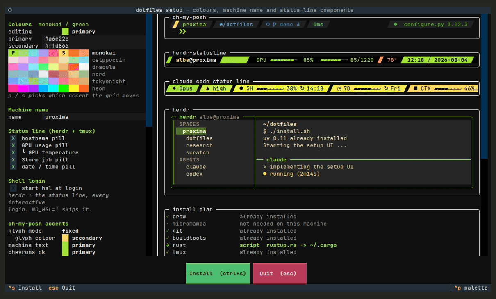
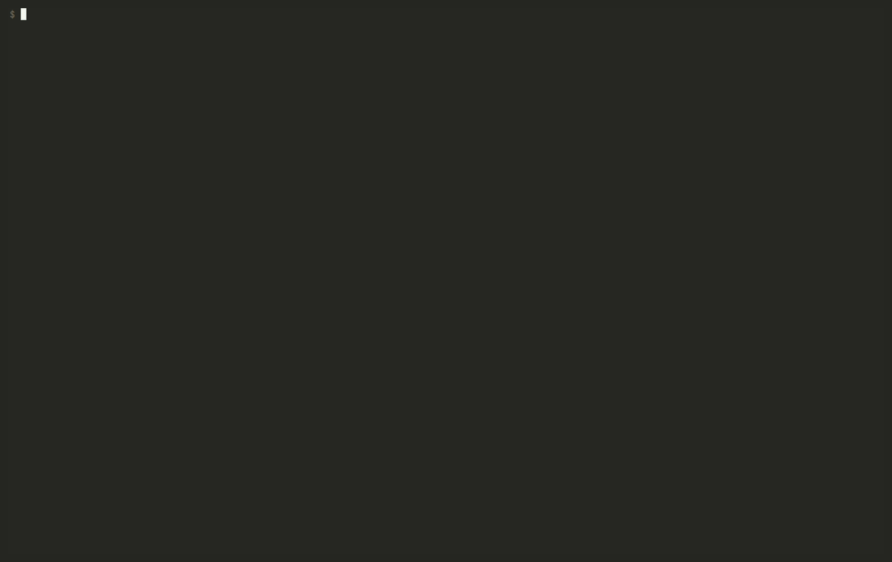
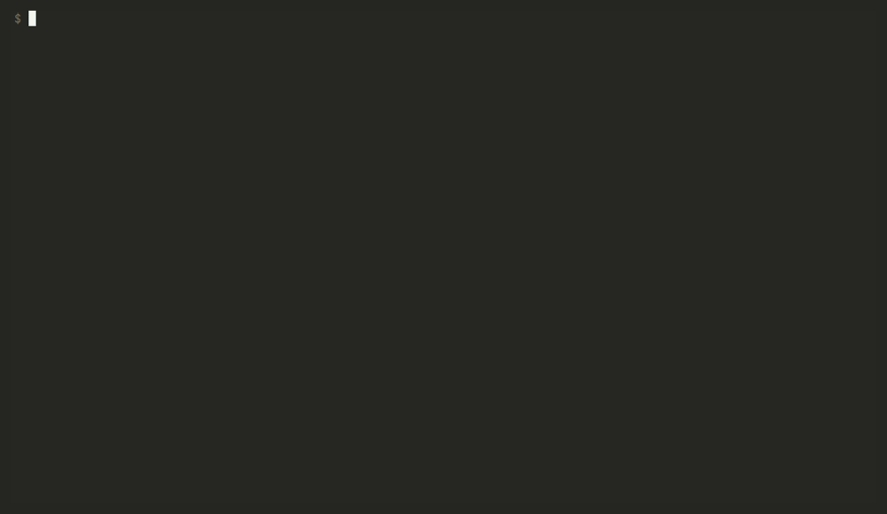
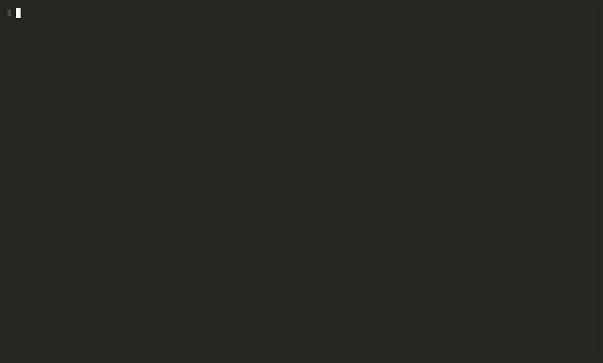

# dotfiles

tmux, Claude Code, oh-my-posh, [herdr](https://github.com/smarzban/herdr) and a
pile of portable shell additions, kept in step across a laptop, a workstation and
a couple of HPC login nodes. On a machine with nothing on it, one line is the
whole thing:

```
curl -fsSL albertorota.dev/setmeup.sh | bash
```

There is no checkout to run from at that point, so the script clones this repo to
`~/dotfiles` and hands over to the copy inside it. Run the same line on a machine
that already has that checkout and it pulls instead of cloning. No git yet? It
falls back to a release tarball — git is itself one of the tools it installs.
Options go through with `bash -s --`, and `DOTFILES_DIR` moves where it lands.

From a clone it is just `./install.sh`.

## Setting a machine up

`./install.sh` installs [uv](https://astral.sh/uv) first, because the setup UI
*is* a uv script, and then opens it:



Two accent colours, the machine name, which pills belong in the status bars, how
oh-my-posh spends the accents, and which tools to put on the machine. `tab`
between fields, arrows in the palette, `p`/`s` to pick which accent the arrows
move, `space` to toggle, `ctrl+s` to install, `esc` to quit. A machine without
uv, or without the network to fetch it, falls back to a plain text wizard, so an
offline box can still be set up.

The panes on the right are the real thing rather than a drawing of it. The prompt
is `oh-my-posh print` on a rendered copy of the actual template, in the actual
git state. The status bar is the string `lib/derive.sh` assembles — the same
function that renders the installed config — with its `#(...)` segments really
executed, so that GPU pill is this machine's `nvidia-smi`. The Claude Code line
is the rendered status line script run against a sample payload. The install plan
is `lib/tools.sh --plan`, the same route resolution the installer performs, so
the pane cannot promise a route the run would not take. Only the herdr box is
drawn, because herdr has no way to render one frame into a string.

The palette is 48 colours as six rows of eight, and each row is one real scheme —
monokai, catppuccin, dracula, nord, tokyonight, neon — so *which row* is itself
part of the choice. Only the accent ramps are in there, never the backgrounds:
the primary gets used as a background with black text on it, so a dark entry
would be illegible where it matters. Any `#rrggbb` works if none of the 48 suit.

Answers land in `~/.config/dotfiles/theme.env` and are reused, which is what
makes a later `./install.sh` a no-prompt re-render.

## What it does to the machine



Anything carrying a colour or the machine name is a `*.in` template with
`@PRIMARY@`-style placeholders, because none of tmux.conf, JSON or TOML can
indirect through a variable. install.sh renders each one into `.generated/`
(gitignored) and points the real config path at the rendered copy:

```
tmux/.tmux.conf.in                 tracked, has @PRIMARY@
  -> .generated/tmux/.tmux.conf    rendered, gitignored
       <- ~/.tmux.conf             symlink
```

So `~` still shows you what is managed, tracked files stay free of
machine-specific values, and re-running the installer updates live config.
**Edit the `.in` file, never the rendered one.**

Before it takes a path over, any real file already sitting there is moved aside
to `<file>.bak`, and only ever on the first run — a second run finds its own
symlink and leaves the backup alone. A backup is never written over: a real file
turning up at a path that already has a `.bak` is filed as `.bak.2`, and the
original stays put. Every path it touches is recorded in
`~/.config/dotfiles/manifest.txt`.

## The `dotfiles` command

Installing puts a `dotfiles` CLI on PATH, so none of this needs the checkout to
be your working directory ever again:



It is a wrapper, not a second implementation — every subcommand runs
`install.sh`, `reset.sh` or `lib/tools.sh` out of the checkout, and options after
the command pass straight through, so `dotfiles install --no-tools` does what you
would expect. It finds the checkout from `$DOTFILES_DIR`, then
`~/.config/dotfiles/checkout` (one line, rewritten by every install), then
`~/dotfiles`.

Two worth knowing before you type them. **`dotfiles uninstall` removes the
`dotfiles` command too** — it is one of the paths install.sh created, so it goes
with the rest; `bash ~/dotfiles/install.sh` brings it all back. And **`dotfiles
purge` is the destructive one**: uninstall, and *then* delete the checkout and
the saved answers. Its order is the point — `reset.sh` lives inside the directory
being deleted, so it runs and finishes first, while it still exists. It refuses
outright if the repo has uncommitted or unpushed work, which is the one thing
here that no reinstall can recover.

## Taking it back off



`reset.sh` reads the manifest back, removes everything on it, restores each
path's `.bak`, and strips the block it added to `~/.bashrc` and `~/.zshrc`.
Numbered backups it reports and leaves alone — choosing between several saved
files is a human's job.

It undoes *config*, not software: the tools stay installed, and each has its own
uninstall. `theme.env` and `.generated/` are left alone too, since the answers
are not part of the installation.

## The tools

Everything in the catalogue is on by default; deselect what you don't want in the
setup UI's checkbox list. The answers persist per machine like the colours do,
and a tool added later switches itself on, since an absent answer means yes.

| | |
|---|---|
| shell | tmux, oh-my-posh, jq, zoxide, eza, fzf, fd, bat, delta, glow, dua-cli |
| network | Tailscale |
| gpu | nvtop, nvitop |
| editor | Neovim + LazyVim, Claude Code |
| python | gdown, ground-control-tui (`uv tool install`) |
| herdr | herdr, herdr-statusline, herdr-file-viewer |
| toolchains | git, Rust, a C toolchain, Homebrew, conda-forge — each only if something needs it |

**Sudo is detected, not assumed.** install.sh works out whether you are root,
have passwordless sudo, are a sudoer who has to type a password, or have no sudo
at all, and picks routes accordingly. With privilege it uses the system package
manager; without, everything lands in `$HOME` through rustup/cargo, `uv tool
install`, release tarballs, git clones or conda-forge. There is no separate
unprivileged installer — just one route list whose first entry drops out. If a
password is needed you are asked once, up front, and saying no falls back to the
userland routes rather than failing.

That last route is what made git and tmux possible without privilege at all.
Both ship as source only, and a machine with no git also has no fzf, no LazyVim
and no way to bootstrap Homebrew, so a bare no-sudo box used to come out with
half the catalogue blocked. conda-forge, reached through micromamba — one static
binary at a fixed URL, no privilege, no Python, nothing to unpack — takes that
from 13 blocked entries to 2. It is deliberately a last resort, behind apt, cargo
and an already-installed Homebrew, and only appears when something you selected
has no other route; on a machine with apt the plan just says *not needed on this
machine*.

Nothing in the phase is fatal. A failed tool is reported and the run carries on.
Anything with no route here is listed as blocked, with the reason, rather than
quietly skipped. `bash lib/tools.sh --plan` shows what a run would do without
doing it.

Tailscale installs but is not connected: `tailscale up` opens a browser to
authenticate the machine, so that is left to you. The run ends with a single
copy-and-paste block holding whatever is still outstanding — the `PATH` export
for the shell you are in, the Tailscale step if there is one, and a `source` of
your login shell's rc.

## Two shells, two platforms

bash and zsh are both configured from one file, `shell/shellrc_additions.sh`,
sourced from `~/.bashrc` and `~/.zshrc` alike; it works out which shell is
reading it and branches only where the two genuinely differ. Which rc files get
the line is detected rather than assumed — bash always, zsh when it is your login
shell or a `~/.zshrc` already exists — and `--shell bash|zsh|both` overrides
that. zsh reads neither `~/.bashrc` nor `~/.profile`, which is why it needs its
own line, and why a Mac set up by an earlier version of this looked like nothing
had installed at all.

A login shell that is neither (fish, csh, ksh) degrades loudly rather than
silently: every tool still installs, `~/.bashrc` is still written, and the run
tells you `bash -l` has the full setup and gives the `chsh` line if you want to
move over.

Linux and macOS both work from the same one-liner. On a Mac, Homebrew is the
system package manager rather than a last resort, Tailscale comes from the
formula and needs `sudo brew services start tailscale`, nvtop is skipped as *not
applicable* rather than failed, and hostnames with apostrophes and spaces in them
are cleaned up rather than rejected. Everything here runs under **bash 3.2**,
which is what `/bin/bash` is on macOS, so `curl … | bash` needs nothing installed
first.

## Layout

- `tmux/`, `oh-my-posh/`, `claude/`, `herdr/` — the config itself, `.in` where it
  carries a colour. `claude/` is Claude Code's *global* settings, keybindings,
  themes and status line; per-project settings stay per-project.
- `shell/` — additions layered on top of each machine's own rc files, not a
  replacement for them.
- `lib/derive.sh` — everything computed *from* the answers: the palette, the
  validators, the assembled status-line strings. install.sh sources it, the setup
  UI executes it and parses the output, which is why the preview and the
  installed config cannot disagree.
- `lib/tools.sh` — the other half of that split: what gets **installed** rather
  than configured. The catalogue, the sudo detection and every route live here.
  Adding a tool means editing this one file.
- `tui/configure.py` — the setup UI. A PEP 723 uv script, so nothing has to be
  installed by hand and nothing is left behind.
- `bin/` — scripts plain-copied to `~/.local/bin`. Drop a file in to have it
  installed everywhere.
- `demo/` — the recordings below, and the tapes that make them.

Deliberately **not** here, because they are specific to one machine or one
cluster: the conda `init` block, Google Cloud SDK sourcing, the
`/anvme/workspace/...` aliases, the `jn_tunnel` ssh alias, herdr's own local state
(it rewrites that itself), and a `fusermount3` shim for one cluster's FUSE setup.

There is no build, no test suite and no linter — this repo *is* the config. To
check a change, run `./install.sh` (it is idempotent) and look at `.generated/`.
The long version of why any of this is shaped the way it is lives in
`CLAUDE.md`.

## The recordings

`demo/record.sh` re-records every GIF in `demo/` with
[vhs](https://github.com/charmbracelet/vhs):

```
demo/record.sh              # all of them
demo/record.sh setup cli    # just those two
```

It needs `vhs` plus what vhs shells out to (`ttyd`, `ffmpeg`, and a headless
Chromium it can find), and a Nerd Font installed — the prompt and both status
bars are mostly powerline glyphs, and without one every tape records a wall of
tofu.

The tapes run the real install.sh, the real setup UI and the real CLI, which is
what makes them worth having, so each one runs against a **throwaway HOME**
rebuilt from scratch before every take. That is why the paths on screen say
`/tmp/dfdemo`, and why nothing you see being installed or uninstalled is
happening to the machine doing the recording.
